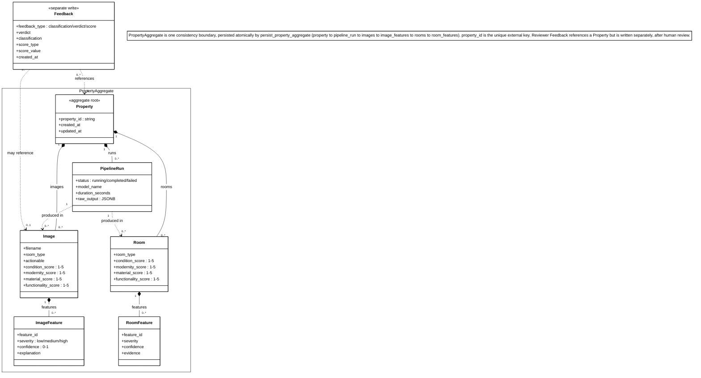
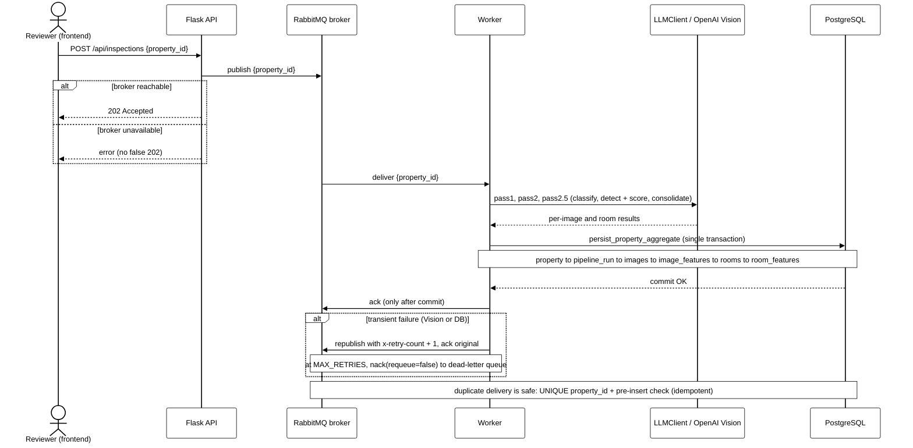
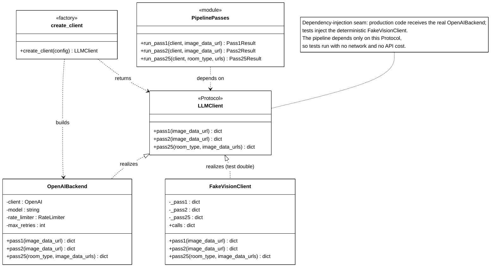
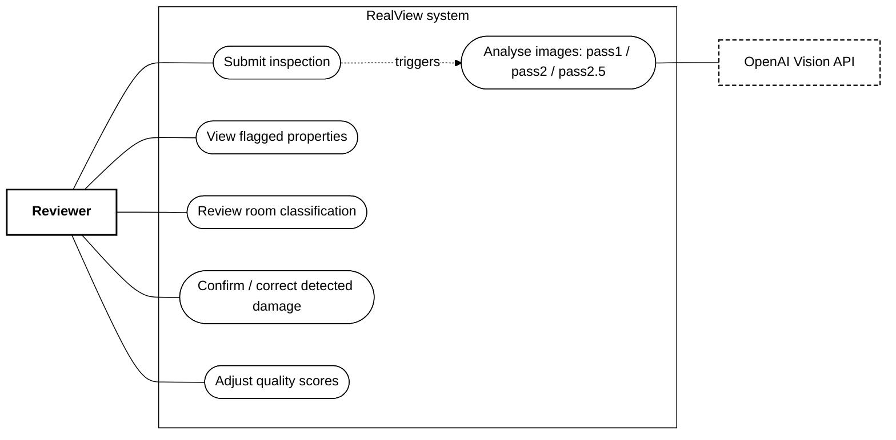

# RealView — system diagrams

These are the UML and architecture diagrams for RealView, written in [Mermaid](https://mermaid.js.org/). **GitHub renders them directly on this page** — no tools to install, and you can click any diagram to zoom in far beyond what the PDF allows. They are the same diagrams as Figures 7–10 in the bachelor report, and they are derived from the code in this repository.

## Domain model (report Figure 7)

The relational data model expressed as a domain-driven-design aggregate. **Property** is the aggregate root; its **PipelineRun**, **Image**, **ImageFeature**, **Room** and **RoomFeature** form a single consistency boundary that is written atomically by `persist_property_aggregate`. **Feedback** references a property but is persisted separately, after human review.

## Asynchronous inspection sequence (report Figure 8)

The end-to-end flow of one inspection. The API returns `202 Accepted` and publishes a job to RabbitMQ; the worker consumes it, runs the Vision passes (`pass1`/`pass2`/`pass2.5`), persists the whole aggregate in a single transaction, and acknowledges the message **only after** the commit. The retry → dead-letter branch and the idempotent handling of duplicate delivery are shown as well.

## LLMClient seam (report Figure 9)

The dependency-injection seam around the OpenAI Vision calls. `LLMClient` is a `Protocol` (`pass1`/`pass2`/`pass25`) realised by the real `OpenAIBackend` and the deterministic `FakeVisionClient`. The pipeline depends only on the Protocol, so the test suite runs with no network and no API cost.

## Use case overview (report Figure 10)

The reviewer's interactions with the system — submitting inspections, viewing flagged properties, and reviewing or correcting the AI output — with the OpenAI Vision API as a secondary actor. (Mermaid has no native UML use-case shape, so actors are drawn as boxes and use cases as rounded nodes.)

